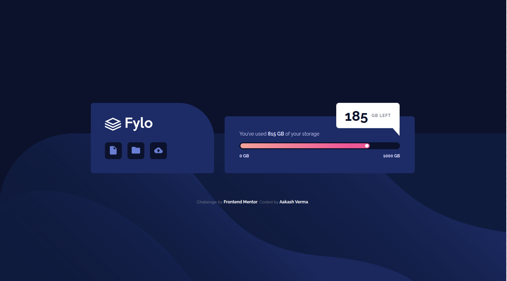
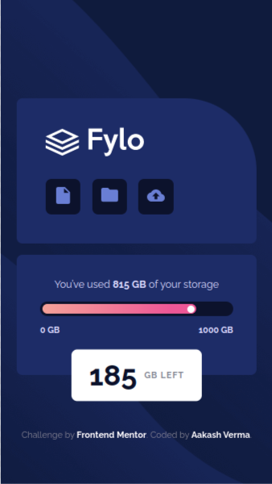

# Frontend Mentor - Fylo data storage component solution

This is a solution to the [Fylo data storage component challenge on Frontend Mentor](https://www.frontendmentor.io/challenges/fylo-data-storage-component-1dZPRbV5n). Frontend Mentor challenges help you improve your coding skills by building realistic projects. 

## Table of contents

- [Overview](#overview)
  - [The challenge](#the-challenge)
  - [Screenshot](#screenshot)
  - [Links](#links)
- [My process](#my-process)
  - [Built with](#built-with)
  - [Continued development](#continued-development)
- [Author](#author)

## Overview

### The challenge

The challenge is to build out this data storage component and get it looking as close to the design as possible.

We can use any tools you like to help you complete the challenge.

Your users should be able to:

- View the optimal layout for the site depending on their device's screen size

### Screenshot

Challenged Design VS My Desktop Solution 
 

 

Challenged Mobile Design VS My Mobile solution 
 

### Links

- Solution URL: [Github](https://github.com/skyv26/Fylo-Data-Storage)
- Live Site URL: [Github Pages](https://skyv26.github.io/Fylo-Data-Storage/)

## My process

Vanilla Js

### Built with

- Semantic HTML5 markup
- CSS custom properties
- Flexbox
- CSS Grid
- Mobile-first workflow

### Continued development

React.js

## Author

- LinkedIn - [@devaakash](https://www.linkedin.com/in/devaakash/)
- Frontend Mentor - [@skyv26](https://www.frontendmentor.io/profile/skyv26)
- Twitter - [@vrma_aakash](https://www.twitter.com/vrma_aakash)